# boardapi

Spring MVC, MyBatis, MySQL을 사용하는 게시판 REST API 예제 프로젝트입니다. JSP 화면, OpenWeatherMap 날씨 조회 화면, Swagger UI가 함께 포함되어 있습니다.

## 기술 스택

| 구분 | 기술 |
| --- | --- |
| Language | Java 17 |
| Build | Gradle 8.8, WAR |
| Framework | Spring MVC 5.3.37 |
| Persistence | MyBatis 3.4.6, mybatis-spring 1.3.2 |
| Database | MySQL 8.x |
| Connection Pool | HikariCP 2.7.4 |
| View | JSP, JSTL |
| API Docs | Springfox Swagger 2.9.2 |
| Logging | Log4j2, log4jdbc |
| Test | JUnit 5, Spring Test |
| Utility | Lombok, Jackson, Apache HttpClient |
| Realtime | Spring WebSocket, Spring Messaging, STOMP |

## 주요 기능

- 게시판 REST API
  - 게시글 목록 조회
  - 게시글 상세 조회
  - 게시글 생성
  - 게시글 수정
  - 게시글 삭제
- MyBatis XML Mapper 기반 DB 접근
- Swagger UI 기반 API 문서
- JSP 기반 메인 화면 및 날씨 화면
- OpenWeatherMap API를 이용한 도시별 현재 날씨 조회
- WebSocket/STOMP 기반 실시간 채팅 예제
- 전역 예외 처리와 404/error JSP

## 주요 파일 관계도

```mermaid
flowchart TB
    subgraph Config["설정"]
        WebConfig["WebConfig.java<br/>DispatcherServlet, UTF-8 필터, multipart"]
        ServletConfig["ServletConfig.java<br/>Controller scan, ViewResolver, 정적 리소스"]
        RootConfig["RootConfig.java<br/>DataSource, MyBatis, TransactionManager"]
        SwaggerConfig["SwaggerConfig.java<br/>Swagger UI/API 문서"]
        WebSocketConfig["WebSocketConfig.java<br/>STOMP WebSocket, /chat-app"]
        AppProps["application.properties<br/>JDBC, OpenWeatherMap 설정"]
        MyBatisConfig["mybatis-config.xml<br/>MyBatis 전역 설정"]
    end

    subgraph Web["웹 계층"]
        HomeController["HomeController.java<br/>메인 JSP"]
        BoardController["BoardController.java<br/>/api/board REST API"]
        WeatherController["WeatherController.java<br/>/weather 화면"]
        ChatController["ChatController.java<br/>/app/hello, /app/chat"]
        ApiAdvice["ApiExceptionAdvice.java<br/>REST 예외 응답"]
        CommonAdvice["CommonExceptionAdvice.java<br/>JSP 예외 화면"]
    end

    subgraph Board["게시판 도메인"]
        BoardService["BoardService.java<br/>서비스 인터페이스"]
        BoardServiceImpl["BoardServiceImpl.java<br/>게시판 비즈니스 로직"]
        BoardMapper["BoardMapper.java<br/>MyBatis Mapper 인터페이스"]
        BoardMapperXml["BoardMapper.xml<br/>tbl_board SQL"]
        BoardDTO["BoardDTO.java<br/>API 요청/응답 데이터"]
        BoardVO["BoardVO.java<br/>DB 매핑 객체"]
    end

    subgraph View["화면/정적 리소스"]
        IndexJsp["index.jsp<br/>채팅 테스트 화면"]
        WeatherJsp["weather/today.jsp"]
        Layouts["layouts/*.jsp"]
        StaticFiles["resources/css, js, images"]
        StompJs["resources/js/stomp.js<br/>STOMP client"]
    end

    subgraph Chat["WebSocket/STOMP 채팅"]
        GreetingMessage["GreetingMessage.java<br/>입장 메시지 DTO"]
        ChatMessage["ChatMessage.java<br/>채팅 메시지 DTO"]
        TopicGreetings["/topic/greetings<br/>입장 알림 구독"]
        TopicChat["/topic/chat<br/>채팅 메시지 구독"]
    end

    subgraph External["외부 시스템"]
        MySQL[("MySQL<br/>scoula_db.tbl_board")]
        OpenWeather["OpenWeatherMap API"]
        SwaggerUi["swagger-ui.html"]
    end

    WebConfig --> ServletConfig
    WebConfig --> RootConfig
    WebConfig --> SwaggerConfig
    WebConfig --> WebSocketConfig
    RootConfig --> AppProps
    RootConfig --> MyBatisConfig
    RootConfig --> BoardMapper
    ServletConfig --> HomeController
    ServletConfig --> BoardController
    ServletConfig --> WeatherController
    ServletConfig --> ChatController
    ServletConfig --> StaticFiles
    SwaggerConfig --> SwaggerUi

    HomeController --> IndexJsp
    IndexJsp --> StompJs
    StompJs --> WebSocketConfig
    StompJs --> ChatController
    ChatController --> GreetingMessage
    ChatController --> ChatMessage
    ChatController --> TopicGreetings
    ChatController --> TopicChat
    TopicGreetings --> StompJs
    TopicChat --> StompJs
    WeatherController --> WeatherJsp
    WeatherController --> AppProps
    WeatherController --> OpenWeather
    BoardController --> BoardService
    BoardController --> BoardDTO
    BoardService --> BoardServiceImpl
    BoardServiceImpl --> BoardMapper
    BoardServiceImpl --> BoardDTO
    BoardServiceImpl --> BoardVO
    BoardMapper --> BoardMapperXml
    BoardMapperXml --> MySQL
    AppProps --> MySQL

    ApiAdvice -.-> BoardController
    CommonAdvice -.-> HomeController
    CommonAdvice -.-> WeatherController
    Layouts --> IndexJsp
    Layouts --> WeatherJsp
```



## 프로젝트 구조

```text
boardapi/
|-- build.gradle
|-- settings.gradle
|-- gradlew
|-- gradlew.bat
|-- src/
|   |-- main/
|   |   |-- java/org/scoula/
|   |   |   |-- advice/
|   |   |   |   `-- LogAdvice.java
|   |   |   |-- board/
|   |   |   |   |-- controller/BoardController.java
|   |   |   |   |-- domain/BoardVO.java
|   |   |   |   |-- dto/BoardDTO.java
|   |   |   |   |-- mapper/BoardMapper.java
|   |   |   |   `-- service/
|   |   |   |       |-- BoardService.java
|   |   |   |       `-- BoardServiceImpl.java
|   |   |   |-- config/
|   |   |   |   |-- RootConfig.java
|   |   |   |   |-- ServletConfig.java
|   |   |   |   |-- SwaggerConfig.java
|   |   |   |   |-- WebConfig.java
|   |   |   |   `-- WebSocketConfig.java
|   |   |   |-- controller/
|   |   |   |   |-- HomeController.java
|   |   |   |   `-- ChatController.java
|   |   |   |-- domain/
|   |   |   |   |-- ChatMessage.java
|   |   |   |   `-- GreetingMessage.java
|   |   |   |-- exception/
|   |   |   |   |-- ApiExceptionAdvice.java
|   |   |   |   `-- CommonExceptionAdvice.java
|   |   |   |-- sample/service/
|   |   |   `-- weather/
|   |   |       |-- controller/WeatherController.java
|   |   |       `-- dto/
|   |   |-- resources/
|   |   |   |-- application.properties
|   |   |   |-- log4j2.xml
|   |   |   |-- log4jdbc.log4j2.properties
|   |   |   |-- mybatis-config.xml
|   |   |   `-- org/scoula/board/mapper/BoardMapper.xml
|   |   `-- webapp/
|   |       |-- resources/
|   |       |   |-- css/main.css
|   |       |   |-- images/
|   |       |   `-- js/
|   |       |       |-- board.js
|   |       |       |-- main.js
|   |       |       `-- stomp.js
|   |       `-- WEB-INF/views/
|   |           |-- index.jsp
|   |           |-- custom404.jsp
|   |           |-- error_page.jsp
|   |           |-- layouts/
|   |           `-- weather/today.jsp
|   `-- test/java/org/scoula/
|       |-- board/mapper/BoardMapperTest.java
|       |-- board/service/BoardServiceImplTest.java
|       |-- config/RootConfigTest.java
|       |-- persistence/JDBCTests.java
|       `-- sample/service/SampleServiceImplTest.java
`-- gradle/wrapper/
```

## 환경 설정

### 사전 요구 사항

- JDK 17
- MySQL 8.x
- Servlet 4.0을 지원하는 WAS
  - 예: Tomcat 9
- IntelliJ IDEA 또는 Gradle 실행 환경

### 데이터베이스 설정

DB 접속 정보는 `src/main/resources/application.properties`에서 관리합니다.

```properties
jdbc.driver=net.sf.log4jdbc.sql.jdbcapi.DriverSpy
jdbc.url=jdbc:log4jdbc:mysql://localhost:3306/scoula_db
jdbc.username=scoula
jdbc.password=1234

weather.url=http://api.openweathermap.org/data/2.5/weather
weather.api_key=OpenWeatherMap_API_KEY
weather.icon_url=http://openweathermap.org/img/w/%s.png
```

로컬 MySQL에 기본 DB와 사용자를 생성합니다.

```sql
CREATE DATABASE scoula_db CHARACTER SET utf8mb4 COLLATE utf8mb4_unicode_ci;

CREATE USER 'scoula'@'localhost' IDENTIFIED BY '1234';
GRANT ALL PRIVILEGES ON scoula_db.* TO 'scoula'@'localhost';
FLUSH PRIVILEGES;
```

게시판 API는 `tbl_board` 테이블을 사용합니다.

```sql
CREATE TABLE tbl_board (
    no BIGINT AUTO_INCREMENT PRIMARY KEY,
    title VARCHAR(200) NOT NULL,
    content TEXT NOT NULL,
    writer VARCHAR(100) NOT NULL,
    reg_date DATETIME DEFAULT CURRENT_TIMESTAMP,
    update_date DATETIME DEFAULT CURRENT_TIMESTAMP
);
```

## 실행 방법

### 빌드

Windows:

```bash
gradlew.bat build
```

macOS/Linux:

```bash
./gradlew build
```

빌드 결과물은 `build/libs/boardapi-1.0-SNAPSHOT.war`에 생성됩니다.

### 서버 실행

이 프로젝트는 WAR 기반 Spring MVC 애플리케이션입니다. Tomcat 9 같은 외부 WAS에 WAR 파일을 배포하거나, IDE의 Tomcat 실행 설정에 프로젝트를 추가해서 실행합니다.

애플리케이션 컨텍스트 경로는 배포 방식에 따라 달라질 수 있습니다. Tomcat에 `boardapi.war`로 배포하면 일반적으로 다음 주소를 사용합니다.

```text
http://localhost:8080/boardapi/
```

## 주요 URL

| Method | URL | 설명 |
| --- | --- | --- |
| GET | `/` | 메인 JSP 화면 |
| GET | `/weather` | 서울 기본 날씨 화면 |
| GET | `/weather/{city}` | 지정 도시 날씨 화면 |
| GET | `/swagger-ui.html` | Swagger UI |
| GET | `/v2/api-docs` | Swagger JSON |
| GET | `/resources/**` | CSS, JS, 이미지 정적 리소스 |
| WS | `/chat-app` | WebSocket/STOMP 연결 엔드포인트 |
| STOMP SEND | `/app/hello` | 입장 메시지 발행 |
| STOMP SEND | `/app/chat` | 채팅 메시지 발행 |
| STOMP SUBSCRIBE | `/topic/greetings` | 입장 알림 구독 |
| STOMP SUBSCRIBE | `/topic/chat` | 채팅 메시지 구독 |

## 게시판 API

기본 경로는 `/api/board`입니다.

| Method | URL | 설명 |
| --- | --- | --- |
| GET | `/api/board` | 게시글 목록 조회 |
| GET | `/api/board/{no}` | 게시글 상세 조회 |
| POST | `/api/board` | 게시글 생성 |
| PUT | `/api/board/{no}` | 게시글 수정 |
| DELETE | `/api/board/{no}` | 게시글 삭제 |

요청/응답 DTO 필드:

| 필드 | 타입 | 설명 |
| --- | --- | --- |
| `no` | Long | 게시글 번호 |
| `title` | String | 제목 |
| `content` | String | 본문 |
| `writer` | String | 작성자 |
| `regDate` | Date | 등록일 |
| `updateDate` | Date | 수정일 |

게시글 생성 예시:

```bash
curl -X POST http://localhost:8080/boardapi/api/board \
  -H "Content-Type: application/json" \
  -d "{\"title\":\"test title\",\"content\":\"test content\",\"writer\":\"user1\"}"
```

게시글 수정 예시:

```bash
curl -X PUT http://localhost:8080/boardapi/api/board/1 \
  -H "Content-Type: application/json" \
  -d "{\"no\":1,\"title\":\"updated title\",\"content\":\"updated content\",\"writer\":\"user1\"}"
```

## 테스트

전체 테스트:

```bash
gradlew.bat test
```

게시판 Mapper 테스트:

```bash
gradlew.bat test --tests org.scoula.board.mapper.BoardMapperTest
```

게시판 Service 테스트:

```bash
gradlew.bat test --tests org.scoula.board.service.BoardServiceImplTest
```

테스트는 로컬 MySQL의 `scoula_db`와 `tbl_board` 테이블이 준비되어 있어야 정상 실행됩니다.

## 주요 설정 파일

| 파일 | 역할 |
| --- | --- |
| `RootConfig.java` | DataSource, MyBatis, TransactionManager, MapperScan 설정 |
| `ServletConfig.java` | Spring MVC, ViewResolver, 정적 리소스, Swagger 리소스 설정 |
| `SwaggerConfig.java` | Swagger Docket 및 API 정보 설정 |
| `WebConfig.java` | DispatcherServlet, UTF-8 필터, multipart 업로드 설정 |
| `WebSocketConfig.java` | STOMP WebSocket 메시지 브로커, `/chat-app`, `/app`, `/topic` 설정 |
| `application.properties` | JDBC 및 OpenWeatherMap API 설정 |
| `mybatis-config.xml` | MyBatis 전역 설정 |
| `BoardMapper.xml` | 게시판 SQL Mapper |
| `log4j2.xml` | Log4j2 로깅 설정 |
| `log4jdbc.log4j2.properties` | log4jdbc SQL 로깅 설정 |

## 참고

- 파일 업로드 임시 위치는 `WebConfig.java`의 `c:/upload`로 설정되어 있습니다.
- 날씨 화면을 사용하려면 `weather.api_key`에 유효한 OpenWeatherMap API 키가 필요합니다.
- `application.properties`에 민감한 접속 정보나 API 키를 직접 커밋하지 않도록 주의합니다.

## 추가 업데이트 내용

최근 변경된 파일 기준으로 WebSocket 채팅 예제, AOP 로그 예제, 샘플 서비스 테스트가 추가되었습니다.

### WebSocket/STOMP 채팅

- `src/main/java/org/scoula/config/WebSocketConfig.java`
  - `@EnableWebSocketMessageBroker`를 사용해 STOMP 기반 WebSocket 메시지 브로커를 활성화합니다.
  - 클라이언트가 서버로 메시지를 보낼 때 사용하는 prefix는 `/app`입니다.
  - 브라우저가 구독하는 topic prefix는 `/topic`입니다.
  - WebSocket 접속 엔드포인트는 `/chat-app`입니다.

- `src/main/java/org/scoula/controller/ChatController.java`
  - `/app/hello`로 들어온 입장 메시지를 `/topic/greetings`로 브로드캐스팅합니다.
  - `/app/chat`으로 들어온 채팅 메시지를 `/topic/chat`으로 브로드캐스팅합니다.

- `src/main/java/org/scoula/domain/GreetingMessage.java`
  - 입장 메시지에 사용하는 DTO입니다.
  - `name` 필드를 가집니다.

- `src/main/java/org/scoula/domain/ChatMessage.java`
  - 채팅 메시지에 사용하는 DTO입니다.
  - `name`, `content` 필드를 가집니다.

- `src/main/webapp/WEB-INF/views/index.jsp`
  - STOMP 채팅 테스트 화면으로 변경되었습니다.
  - 이름 입력, WebSocket 연결/해제, 메시지 입력/전송, 수신 메시지 목록 표시 UI를 포함합니다.

- `src/main/webapp/resources/js/stomp.js`
  - STOMP 클라이언트를 생성하고 `ws://localhost:8080/chat-app`으로 연결합니다.
  - 연결 후 `/topic/greetings`, `/topic/chat`을 구독합니다.
  - 연결 성공 시 `/app/hello`로 입장 메시지를 전송합니다.
  - 메시지 전송 버튼 클릭 시 `/app/chat`으로 채팅 메시지를 전송합니다.

채팅 메시지 흐름:

```text
브라우저 stomp.js
  -> ws://localhost:8080/chat-app 연결
  -> /app/hello 또는 /app/chat 발행
  -> ChatController 처리
  -> /topic/greetings 또는 /topic/chat 브로드캐스팅
  -> 구독 중인 브라우저 화면에 메시지 출력
```

주의: WAR를 `boardapi` 컨텍스트 경로로 배포하는 경우 WebSocket URL은 배포 환경에 맞게 `/boardapi/chat-app` 형태가 필요할 수 있습니다. 현재 `stomp.js`는 `ws://localhost:8080/chat-app`을 기준으로 작성되어 있습니다.

### AOP 로그 예제

- `src/main/java/org/scoula/advice/LogAdvice.java`
  - `org.scoula.sample.service.SampleService` 계열 메서드 실행을 대상으로 로그를 출력합니다.
  - 메서드 실행 전 로그, 특정 파라미터 로그, 예외 로그, 실행 시간 로그를 확인할 수 있습니다.

- `src/main/java/org/scoula/config/RootConfig.java`
  - `org.scoula.sample.service`, `org.scoula.advice` 패키지를 컴포넌트 스캔 대상에 추가했습니다.
  - `@EnableAspectJAutoProxy`로 AOP 프록시 기능을 활성화합니다.

### Web 설정 변경

- `src/main/java/org/scoula/config/WebConfig.java`
  - Servlet 설정 클래스 목록에 `WebSocketConfig.class`를 추가해 WebSocket 설정이 DispatcherServlet 환경에 등록되도록 했습니다.

### 샘플 서비스 테스트

- `src/test/java/org/scoula/sample/service/SampleServiceImplTest.java`
  - `RootConfig` 기반 Spring 테스트로 `SampleService`를 주입받아 실행합니다.
  - `doAdd("123", "456")` 정상 케이스와 `doAdd("123", "ABC")` 예외 케이스를 실행해 AOP 로그 동작을 확인할 수 있습니다.

샘플 서비스 테스트 실행:

```bash
gradlew.bat test --tests org.scoula.sample.service.SampleServiceImplTest
```
